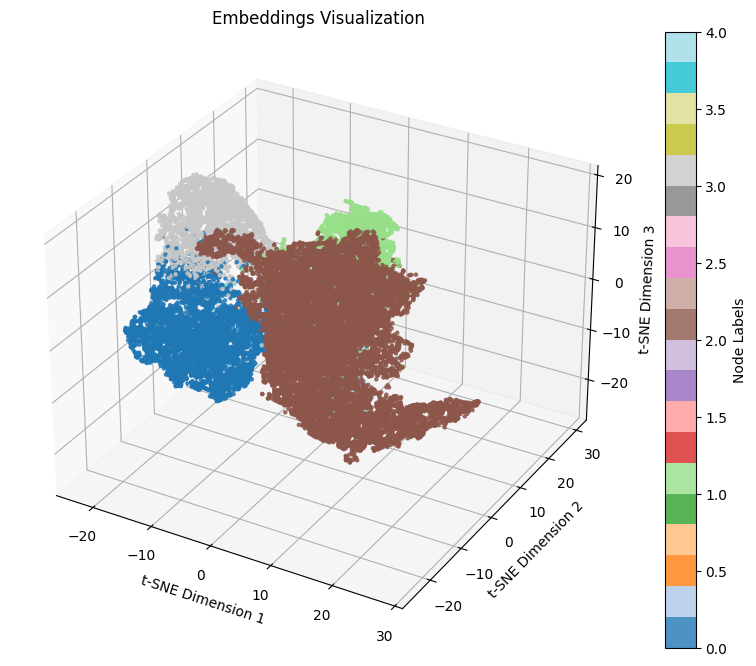

# GRACE: Graph-based Random Walk Autoencoder Compression for Embedding

Welcome to the official repository for **GRACE**, a scalable framework for graph embedding introduced in the paper:

> **"GRACE: A Scalable Framework for Graph Embedding with Autoencoder-Based Feature Compression and Random Walks"**  
> Mohammad Mehdi Keikha, Saman Barahoie, and Abolfazl Nadi

This framework combines autoencoder-based feature compression, random walks, and graph attention mechanisms to generate high-quality, scalable node embeddings for graphs.

---

## 📌 Overview

**GRACE** is designed to address the scalability and computational challenges of graph representation learning. It integrates three key components:

- 🔄 **Autoencoder-Based Feature Compression**: Reduces node feature dimensionality while preserving structural information.
- 🌀 **Random Walks**: Captures long-range dependencies and global graph topology efficiently.
- 🎯 **Graph Attention Mechanisms**: Enhances embedding quality by focusing on the most relevant structural and semantic details.

Our experiments on real-world datasets (**Photo**, **Coauthor CS**, and **Coauthor Physics**) demonstrate that GRACE outperforms state-of-the-art methods in accuracy, scalability, and resource efficiency.

---

## 🌟 Features

- ✅ Scalable mini-batch generation with **parallel random walks**
- ✅ **GAT model** with autoencoder and residual connections
- ✅ **GPU/CPU** resource utilization monitoring
- ✅ **3D t-SNE** embedding visualization
- ✅ Comprehensive evaluation on benchmark datasets

---

## 📦 Installation

Install the required dependencies:

```bash
pip install -r requirements.txt
```

---

## 🚀 Usage

Run the main script with default parameters:

```bash
python src/main.py --data-path data/amazon_electronics_photo.npz
```

Customize training parameters (e.g., batch sizes, epochs):

```bash
python src/main.py --data-path your_data.npz --batch-sizes 500 1000 --epochs 50 --walk-length 100
```

---

## ⚙️ Command-Line Arguments

| Argument          | Description                                     | Default                |
|-------------------|-------------------------------------------------|------------------------|
| `--data-path`     | Path to the `.npz` graph data file              | -                      |
| `--walk-length`   | Length of random walks                          | `100`                  |
| `--hidden-dim`    | Hidden layer dimension                          | `128`                  |
| `--encoding-dim`  | Encoded feature dimension                       | `64`                   |
| `--lr`            | Learning rate                                   | `0.01`                 |
| `--epochs`        | Number of training epochs                       | `50`                   |
| `--batch-sizes`   | List of batch sizes                             | `[1000]`               |
| `--output-csv`    | Output file for accuracy results                | `accuracy_table.csv`   |
| `--device`        | Device to use (`cuda` or `cpu`)                 | Auto-detected          |

---

## 📁 Project Structure

```
grace/
├── README.md              # This file
├── requirements.txt       # Dependencies
├── src/                   # Source code
│   ├── models.py          # GRACE model architecture
│   ├── training.py        # Training and evaluation utilities
│   ├── utils.py           # Data loading and visualization tools
│   ├── config.py          # Hyperparameters
│   └── main.py            # Main script
├── data/                  # Dataset folder
│   └── README.md          # Instructions for datasets
├── results/               # Output folder (e.g., accuracy_table.csv)
├── assets/                # Images for framework and t-SNE visualization
└── LICENSE                # BSD 3-Clause License
```

---

## 📊 Datasets

The code is tested on the following datasets:

| Dataset          | #Nodes  | #Edges   | #Features | #Classes |
|------------------|---------|----------|-----------|----------|
| Photo            | 7,650   | 119,081  | 745       | 8        |
| Coauthor CS      | 18,333  | 81,894   | 6,805     | 15       |
| Coauthor Physics | 34,493  | 247,962  | 8,415     | 5        |

Place your `.npz` dataset files in the `data/` folder and update the `--data-path` argument accordingly.  
For dataset details, see `data/README.md`.

---

## 📈 Results

GRACE achieves state-of-the-art performance:

| Dataset          | Accuracy (%)         |
|------------------|----------------------|
| Photo            | 97.40 ± 0.32         |
| Coauthor CS      | 98.35 ± 0.39         |
| Coauthor Physics | 99.20 ± 0.18         |

Results are saved to `results/accuracy_table.csv`.  
Visualizations of embeddings are generated using **t-SNE** during training.

---

## 🖼️ Visualizations

### t-SNE Embedding Visualization



---

## 📚 Citation

If you use GRACE in your research, please cite:

```bibtex
@article{keikha2025grace,
  title     = {GRACE: A Scalable Framework for Graph Embedding with Autoencoder-Based Feature Compression and Random Walks},
  author    = {Keikha, Mohammad Mehdi and Barahoie, Saman and Nadi, Abolfazl},
  journal   = {To Appear},
  year      = {2025}
}
```

---

## 🤝 Contributing

Contributions are welcome! Please:

1. Fork the repository 🍴  
2. Create a feature branch 🌿  
3. Submit a pull request 🔁  
4. Open an issue to discuss major changes 🧠

---

## 📜 License

This project is licensed under the **BSD 3-Clause License**.  
See the `LICENSE` file for more details.

---

## 🙏 Acknowledgments

We thank **Ahura Artificial Intelligence Operator (Iran GPU Company)** for providing graphical computing hardware under Agreement No. 031015/117.

---

**Built with ❤️ by Saman Barahoie**  
📬 Contact: [smaibrave@gmail.com](mailto:smaibrave@gmail.com)
```
